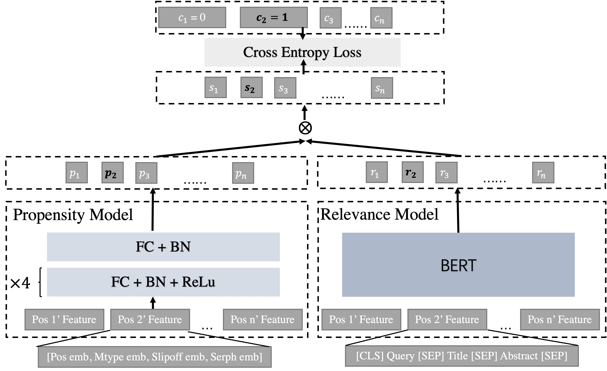

# WSDM 2023 Cup: Unbias Learning to Rank for A Large Scale Search Dataset from Baidu Search Engine

## 1 Background
This repository is the solution to the [WSDM 2023 Unbiased Learning for Web Search](https://aistudio.baidu.com/aistudio/competition/detail/534/0/introduction). 
On the basis of [the Dual Learning Algorithm (DLA)](https://arxiv.org/pdf/1804.05938.pdf), our solution conducts extensive and in-depth research on unbias learning to rank and proposes a strategy of using multiple behavioral features for unbiased learning, which greatly improves the performance of ranking models.

## 2 Model Overview
The overall framework of the model is shown in Fig.1.



Taking the data of one search session as an example, as shown in Fig.1, 
the text features of the document at position `n` will be fed into the relevance model to output the relevance score `r`, 
while other features of the document that can be used to calculate the propensity score are fed into the propensity model to get the propensity score `s`.
Subsequently, `p` and `r` are multiplied to obtain the score `s` of the position `n` being clicked.

Note, instead of inputting the entire document list for the session, we pick a group of documents whose group size is 6 from the document list, including 1 document (positive sample) that is clicked and 5 documents (negative samples) that are not clicked.
In addition, only the propensity score of the positive sample is provided by the model, while the propensity socre of the negative sample is forced to be set to a fixed value 0.1, which means that `p1`、`p3` and `pn` in Fig.1 is 0.1.
## 3 Environment

The environment of unbias learning to rank task is same as [the Pre-training for Web Search Task](../README.md).

## 4 Quick Start

### 4.1 Prepare the corpus
Suppose your have downloaded [the Web Search Session Data](https://drive.google.com/drive/folders/1Q3bzSgiGh1D5iunRky6mb89LpxfAO73J?usp=sharing) (training data) and [annotation_data_0522.txt](https://drive.google.com/file/d/1hdWRRSMrCnQxilYfjTx8RhW3XTgiSd9Q/view?usp=sharing) (test data) on Google drive.
Moreover, for those who cannot access google drive:
- [training data](https://searchscience.baidu.com/dataset_ultr_train.html) 
- [test data](https://searchscience.baidu.com/baidu_ultr/labeled_dataset/test_data.txt)

Note: unzip the train data may spend a lot of time.

### 4.2 The Pre-trained Language Model

A pre-trained language model is important for the model in Fig.1. You can download the pre-trained language model we trained from the table below:

|         PTM Version         |                URL                |
|:---------------------------:|:---------------------------------:|
|   **Bert_Layer12_Head12**   |   [Bert_Layer12_Head12](https://huggingface.co/lixsh6/wsdm23_unbiased/blob/main/pretrain/base_group2.zip)   |
| **Bert_Layer12_Head12 wwm** | [Bert_Layer12_Head12 wwm](https://huggingface.co/lixsh6/wsdm23_unbiased/blob/main/pretrain/base_group2.zip) |
|   **Bert_Layer24_Head12**    |   [Bert_Layer24_Head12](https:https://huggingface.co/lixsh6/wsdm23_unbiased/blob/main/pretrain/base_group2.zip)   |
In Table, wwm means that we use whole word masking.

### 4.3 Directory Structure
After the corpus and pre-trained language model is ready, you should organize them with the following directory structure:

`Your Data Root Path`  
|——`baidu_ultr`  
|&emsp;&emsp;&emsp;&emsp;&emsp;&emsp;   |——`data`  
|&emsp;&emsp;&emsp;&emsp;&emsp;&emsp;   |&emsp;&emsp;&emsp;&emsp;&emsp;&emsp;&emsp;&emsp;|——part-00000  
|&emsp;&emsp;&emsp;&emsp;&emsp;&emsp;   |&emsp;&emsp;&emsp;&emsp;&emsp;&emsp;&emsp;&emsp;|——part-00001  
|&emsp;&emsp;&emsp;&emsp;&emsp;&emsp;   |&emsp;&emsp;&emsp;&emsp;&emsp;&emsp;&emsp;&emsp;|——...  
|&emsp;&emsp;&emsp;&emsp;&emsp;&emsp;   |——`annotate_data`  
|&emsp;&emsp;&emsp;&emsp;&emsp;&emsp;   |&emsp;&emsp;&emsp;&emsp;&emsp;&emsp;&emsp;&emsp;|——annotation_data_0522.txt  
|&emsp;&emsp;&emsp;&emsp;&emsp;&emsp;   |&emsp;&emsp;&emsp;&emsp;&emsp;&emsp;&emsp;&emsp;|——wsdm_test_1.txt  
|&emsp;&emsp;&emsp;&emsp;&emsp;&emsp;   |&emsp;&emsp;&emsp;&emsp;&emsp;&emsp;&emsp;&emsp;|——wsdm_test_2_all.txt  
|&emsp;&emsp;&emsp;&emsp;&emsp;&emsp;   |——`ckpt`  
|&emsp;&emsp;&emsp;&emsp;&emsp;&emsp;   |&emsp;&emsp;&emsp;&emsp;&emsp;&emsp;&emsp;&emsp;|——`submit`  
|&emsp;&emsp;&emsp;&emsp;&emsp;&emsp;   |&emsp;&emsp;&emsp;&emsp;&emsp;&emsp;&emsp;&emsp;|&emsp;&emsp;&emsp;&emsp;&emsp;&emsp;&emsp;&emsp;|——model_name   
|&emsp;&emsp;&emsp;&emsp;&emsp;&emsp;   |&emsp;&emsp;&emsp;&emsp;&emsp;&emsp;&emsp;&emsp;|&emsp;&emsp;&emsp;&emsp;&emsp;&emsp;&emsp;&emsp;&emsp;&emsp;&emsp;&emsp;&emsp;&emsp;&emsp;&emsp;|——config.json   
|&emsp;&emsp;&emsp;&emsp;&emsp;&emsp;   |&emsp;&emsp;&emsp;&emsp;&emsp;&emsp;&emsp;&emsp;|&emsp;&emsp;&emsp;&emsp;&emsp;&emsp;&emsp;&emsp;&emsp;&emsp;&emsp;&emsp;&emsp;&emsp;&emsp;&emsp;|——pytorch.bin  
|&emsp;&emsp;&emsp;&emsp;&emsp;&emsp;   |&emsp;&emsp;&emsp;&emsp;&emsp;&emsp;&emsp;&emsp;|——`pretrain`  
|&emsp;&emsp;&emsp;&emsp;&emsp;&emsp;   |&emsp;&emsp;&emsp;&emsp;&emsp;&emsp;&emsp;&emsp;|&emsp;&emsp;&emsp;&emsp;&emsp;&emsp;&emsp;&emsp;|——model_name   
|&emsp;&emsp;&emsp;&emsp;&emsp;&emsp;   |&emsp;&emsp;&emsp;&emsp;&emsp;&emsp;&emsp;&emsp;|&emsp;&emsp;&emsp;&emsp;&emsp;&emsp;&emsp;&emsp;&emsp;&emsp;&emsp;&emsp;&emsp;&emsp;&emsp;&emsp;|——config.json   
|&emsp;&emsp;&emsp;&emsp;&emsp;&emsp;   |&emsp;&emsp;&emsp;&emsp;&emsp;&emsp;&emsp;&emsp;|&emsp;&emsp;&emsp;&emsp;&emsp;&emsp;&emsp;&emsp;&emsp;&emsp;&emsp;&emsp;&emsp;&emsp;&emsp;&emsp;|——pytorch.bin

### 4.3 Training Model
- Modify `data_root` in `./pretrain/start.sh` as `Your Data Root Path`
- Then,
``` 
cd pretrain
sh start.sh
```
- You can apply tensorboard in `output_dir` to observe the trend of model indicators

### 4.4 Test Model
#### 4.4.1 Single model
In order to quickly test the model performance, you can directly download [model trained by us](https://huggingface.co/lixsh6/wsdm23_unbiased/blob/main/submit/group6_pos_slipoff_serph_emb8_mlp5l.zip) whose dcg@10 is 10.25 on annotation_data_0522.txt (val dataset)  
Then, modify `data_root` as `Your Data Root Path`、 `model_name_or_path` as `the path of model you want to test` and `model_w` as `1` in `./submit/start.sh`.  
Finally
``` 
cd submit
sh start.sh
```

#### 4.4.2 Model Ensemble
In order to further improve the performance of the model, we used the weighted sum of the output scores of multiple models trained under different settings that we produced during the experiment as the final relevance score.  
You can download these model with different setting from the table below:

|       Model Name        |             URL              | DCG@10 <br/>on val dataset |
|:-----------------------:|:----------------------------:|:---------------------:|
|          **group6_pos_slipoff_mtype_serph_emb8_mlp5l_maxmeancls_bs48**          |      [Download](https://huggingface.co/lixsh6/wsdm23_unbiased/blob/main/submit/group6_pos_slipoff_mtype_serph_emb8_mlp5l_maxmeancls_bs48.zip) |         10.03         |
|          **group6_pos_slipoff_mtype_serph_emb8_mlp5l_maxmeancls**          |      [Download](https://huggingface.co/lixsh6/wsdm23_unbiased/blob/main/submit/group6_pos_slipoff_mtype_serph_emb8_mlp5l_maxmeancls.zip)      |         10.14         |
| **group6_pos_slipoff_mtype_serph_emb8_mlp5l_wwm** |      [Download](https://huggingface.co/lixsh6/wsdm23_unbiased/blob/main/submit/group6_pos_slipoff_mtype_serph_emb8_mlp5l_wwm.zip)      |         10.16         |
| **group6_pos_slipoff_serph_emb8_mlp5l_24l** |      [Download](https://huggingface.co/lixsh6/wsdm23_unbiased/blob/main/submit/group6_pos_slipoff_serph_emb8_mlp5l_24l.zip)      |         10.10         |
| **group6_pos_slipoff_serph_emb8_mlp5l** |      [Download](https://huggingface.co/lixsh6/wsdm23_unbiased/blob/main/submit/group6_pos_slipoff_serph_emb8_mlp5l.zip)      |         10.25         |
| **group6_pos_slipoff_mtype_serph_emb8_bnnoelu_mlp5l_relu** |      [Download](https://huggingface.co/lixsh6/wsdm23_unbiased/blob/main/submit/group6_pos_slipoff_mtype_serph_emb8_bnnoelu_mlp5l_relu.zip)      |         10.20         |
| **group6_pos_slipoff_mtype_serph_emb8_bnnoelu_dropout_mlp5l_relu** |      [Download](https://huggingface.co/lixsh6/wsdm23_unbiased/blob/main/submit/group6_pos_slipoff_mtype_serph_emb8_bnnoelu_dropout_mlp5l_relu.zip)      |         10.14         |
| **group6_pos_slipoff_mtype_serph_emb8_bnnoelu_mlp5l_relu_24l** |      [Download](https://huggingface.co/lixsh6/wsdm23_unbiased/blob/main/submit/group6_pos_slipoff_mtype_serph_emb8_bnnoelu_mlp5l_relu_24l.zip)      |         10.23         |
| **group6_pos_slipoff_mtype_serh_emb8_bnnoelu** |      [Download](https://huggingface.co/lixsh6/wsdm23_unbiased/blob/main/submit/group6_pos_slipoff_mtype_serh_emb8_bnnoelu.zip)      |         10.15         |
| **group6_pos_slipoff_mtype_emb8_bnnoelu** |      [Download](https://huggingface.co/lixsh6/wsdm23_unbiased/blob/main/submit/group6_pos_slipoff_mtype_emb8_bnnoelu.zip)      |         10.15         |
| **group6_pos_slipoff_serh_emb8** |      [Download](https://huggingface.co/lixsh6/wsdm23_unbiased/blob/main/submit/group6_pos_slipoff_serh_emb8.zip)      |         10.05         |
| **group6_pos_slipoff_pad_with_pretrain_emb8** |      [Download](https://huggingface.co/lixsh6/wsdm23_unbiased/blob/main/submit/group6_pos_slipoff_pad_with_pretrain_emb8.zip)      |         10.05         |

Then, modify `data_root` as `Your Data Root Path`、 `model_name_or_path` as `the path of model you want to test` and `model_w` as `0.10,0.35,0.50,0.25,0.40,0.10,0.10,0.55,0.35,0.05,0.1,0.50` in `./submit/start.sh`, in which `model_w` is set manually.  

Finally
``` 
cd submit
sh start.sh
```

The dcg@10 of model Ensemble on val dataset is 10.54 (10.14 on final test dataset)

## Contacts
- Xiaoshu Chen:  [xschenranker@gmail.com](xschenranker@gmail.com)